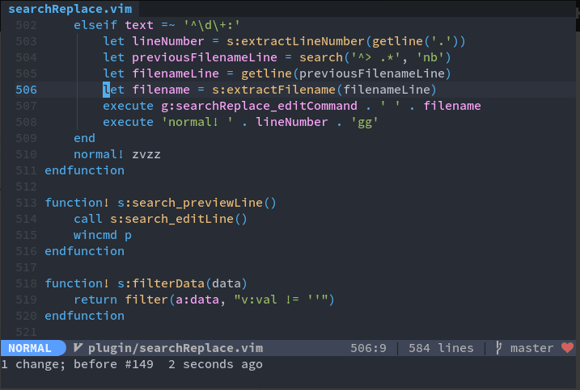

# LHS/RHS operator

A text object for the LHS or RHS of the equal-sign (or colon).

```javascript

//                                 al
//      ah      |----------------------------------------|
//  |-----------|
//      ih                         il
//  |---------|   |--------------------------------------|
    const value = [ { id: 42, text: 'alomeeaqswabwzix' } ]

```

Usage (default mappings):

| Mode | Mapping | Effect |
|------|---------|--------|
| operator, visual | `il` | select inside RHS |
| operator, visual | `ih` | select inside LHS |
| operator, visual | `al` | select all RHS |
| operator, visual | `ah` | select all LHS |


Configure your own mappings as such:

```viml
let equal_operator_default_mappings = 0

omap =h <Plug>(operator-lhs)
omap =l <Plug>(operator-Lhs)
omap =H <Plug>(operator-rhs)
omap =L <Plug>(operator-Rhs)

vmap =h <Plug>(visual-lhs)
vmap =l <Plug>(visual-rhs)
vmap =H <Plug>(visual-Lhs)
vmap =L <Plug>(visual-Rhs)
```

### Demo



### Support

This plugin uses a pattern to match the following lines:

```
let lhs = get_value()

Lhs->Rhs("ok");

       lhs "value"

let lhs += 'string'

     lhs => "value"

let lhs >>= 'string'

return rhs
```

## License

Same as JSON as far as I'm concerned, but most of the code here is freely adapted from
[Learn Vimscript the Hard Way][1]. (eternal thanks to Steve Losh)

[1](http://learnvimscriptthehardway.stevelosh.com/)
